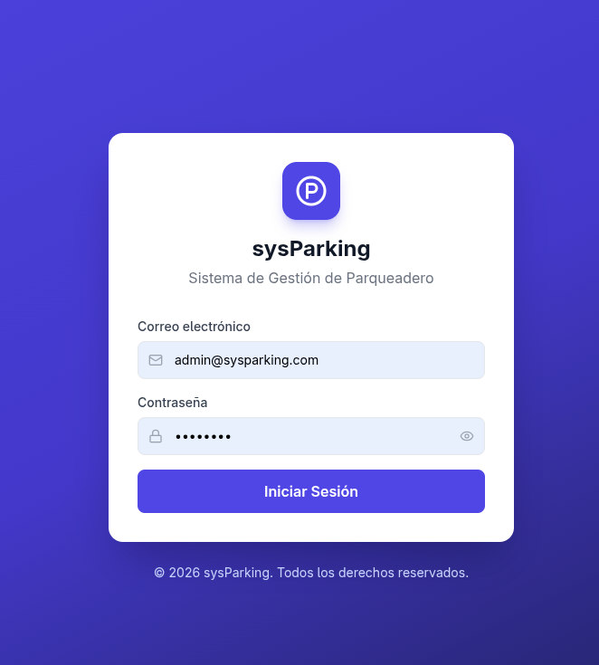
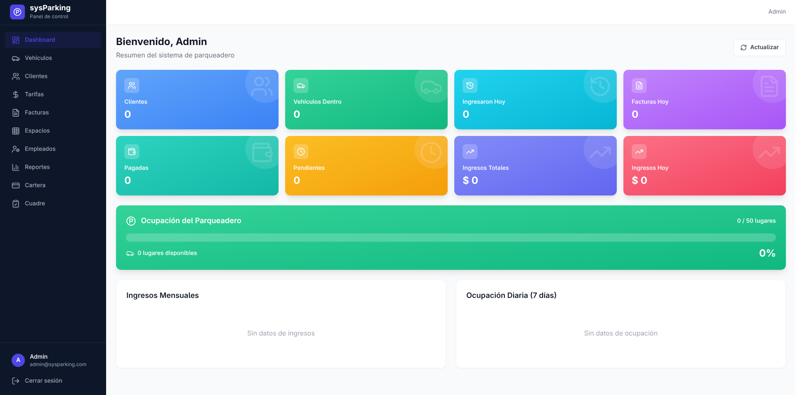
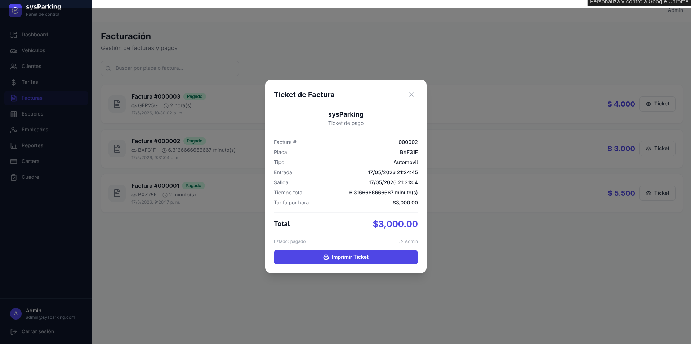
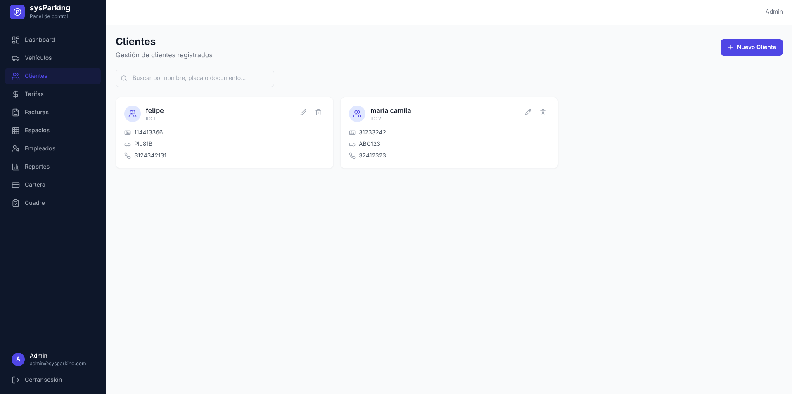
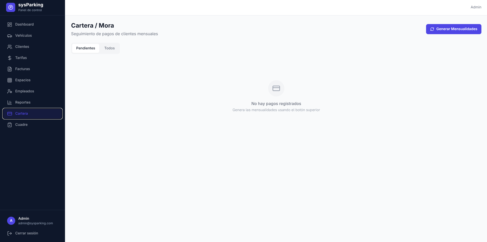
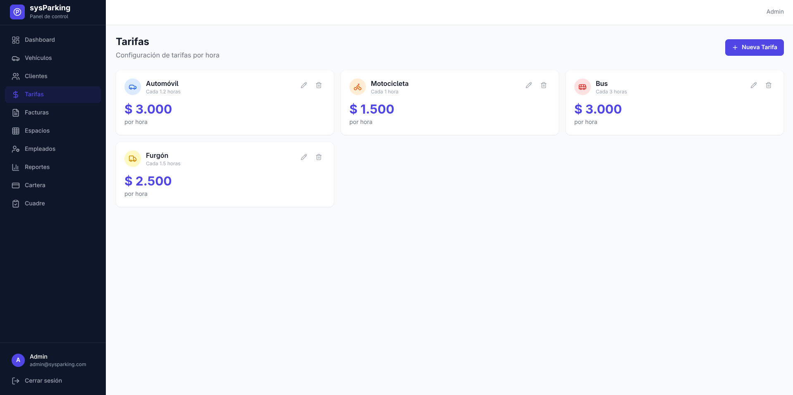
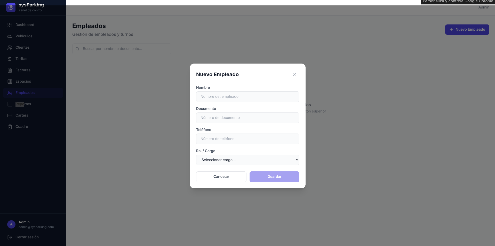
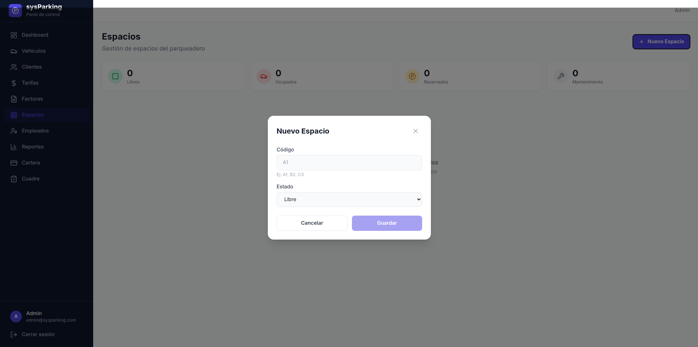
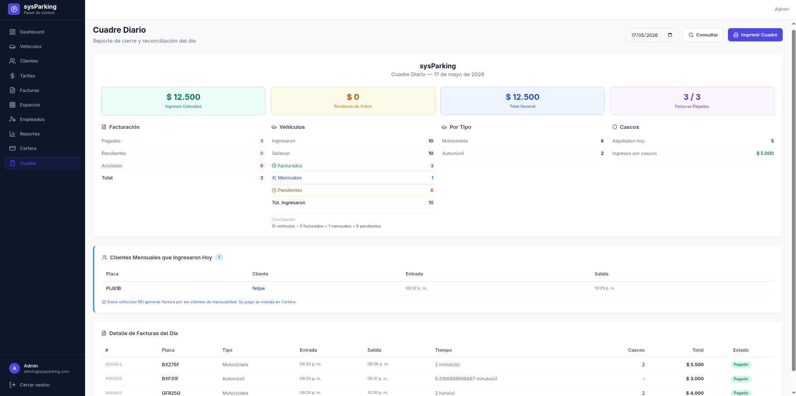
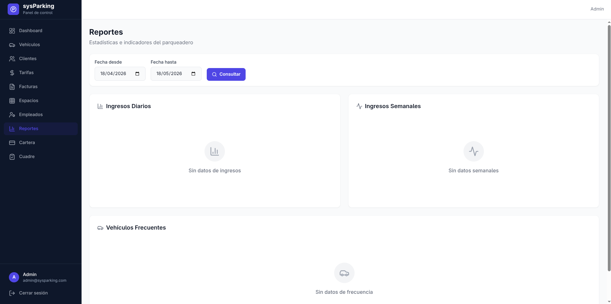

# sysParking

Sistema de gestión de parqueadero con Laravel + React. Control de entrada/salida de vehículos, facturación, clientes mensuales, alquiler de cascos, turnos de empleados, espacios, cartera/mora y reportes.

## Stack

| Capa       | Tecnología                     |
| ---------- | ------------------------------ |
| Backend    | Laravel 11 + Sanctum           |
| Frontend   | React 19 + Vite + Tailwind CSS |
| BD         | SQLite                         |
| Notificaciones | Notiflix                   |
| Gráficos   | Recharts                       |

## Requisitos

- PHP 8.2+
- Composer
- Node.js 20+
- npm

## Instalación

```bash
# 1. Clonar
git clone <repo>
cd sysParking

# 2. Backend
cd backend
cp .env.example .env
composer install
php artisan key:generate
php artisan migrate --force
php artisan config:cache
cd ..

# 3. Frontend
cd frontend
npm install
npm run build
cd ..

# 4. Servir
cd backend
php artisan serve --host=0.0.0.0 --port=8000
```

## Estructura

```
sysParking/
├── backend/
│   ├── app/
│   │   ├── Enums/              # EstadoFactura, EstadoEspacio
│   │   ├── Http/
│   │   │   ├── Controllers/    # API controllers
│   │   │   ├── Requests/       # FormRequest validation
│   │   │   └── Resources/      # API Resources
│   │   ├── Models/             # Eloquent models
│   │   └── Services/           # ParkingService, FacturacionService, EstadisticaService
│   ├── config/
│   │   └── tipos_vehiculo.php  # Vehicle type names
│   ├── database/
│   │   └── migrations/         # All table schemas + seed data
│   └── routes/api.php          # API routes
├── frontend/
│   └── src/
│       ├── components/         # Layout, Loading, EmptyState
│       ├── contexts/           # AuthContext
│       ├── hooks/              # useVehiculos
│       ├── pages/              # All page components
│       ├── services/           # API service wrappers
│       └── utils/              # formatters, constants, notiflix config
└── README.md
```

## Funcionalidades

### Vehículos
- Registro de entrada con placa, tipo y cascos
- Salida con cálculo automático de tiempo y costo estimado
- Clients mensuales: si la placa está registrada omite facturación por visita
- Tabs: Dentro / Salidos Hoy / Todos
- Búsqueda por placa

### Facturación
- Generación automática al dar salida
- Cálculo: horas × tarifa + cascos × precio_casco
- Estados: pendiente / pagado / anulado
- Ticket imprimible con detalle completo
- Resumen diario (ingresos, facturas, pendientes)

### Clientes Mensuales
- CRUD de clientes con placa asociada
- Al registrar salida, si la placa es mensual → no genera factura
- Cartera/Mora: seguimiento de pagos mensuales
- Generar mensualidades y registro de pagos

### Tarifas
- Configuración por tipo de vehículo (7 tipos)
- Valor por hora y fracción mínima
- Los tipos vienen de la DB (tipo_vehiculos)

### Empleados
- CRUD con cargo seleccionable (Cajero, Supervisor, etc.)
- Activar/desactivar
- Turnos: iniciar y cerrar turno con timestamp

### Espacios
- Mapa visual numerado (A1, A2, ...)
- Estados: libre / ocupado / reservado / mantenimiento
- Colores: verde, rojo, ámbar, gris
- Al dar entrada se puede asignar espacio; al salir se libera

### Dashboard
- Cards con gradientes: clientes, vehículos dentro/hoy, facturas, ingresos
- Barra de ocupación con advertencia al ≥80%
- Gráfico de ingresos mensuales
- Gráfico de ocupación diaria (7 días)

### Reportes
- Filtro por rango de fechas
- Ingresos diarios (gráfico de barras)
- Ingresos semanales (gráfico de líneas)
- Vehículos frecuentes (top 10)
- Resumen diario

### Cuadre Diario
- Reconciliación: total vehículos = facturados + mensuales
- Ingresos cobrados, pendientes, total general
- Desglose por tipo de vehículo
- Clientes mensuales que ingresaron (lista detallada)
- Detalle de todas las facturas del día
- Botón para imprimir

### Usuarios del Sistema
- Roles: super-admin, admin, operador (desde DB)
- Login con Sanctum (token)
- CRUD de usuarios con selección de rol

### Exportación CSV
- Facturas, clientes, vehículos

### Notificaciones
- Notiflix: notificaciones toast y confirmaciones modales
- Colores: verde (éxito), rojo (error), ámbar (advertencia)

## API

Todas las rutas bajo `/api` requieren autenticación con token Sanctum (excepto `/login` y `/register`).

| Método | Ruta                          | Descripción                |
| ------ | ----------------------------- | -------------------------- |
| POST   | /api/login                    | Iniciar sesión             |
| POST   | /api/logout                   | Cerrar sesión              |
| GET    | /api/me                       | Datos del usuario actual   |
| GET    | /api/vehiculo                 | Listar vehículos           |
| POST   | /api/vehiculo                 | Registrar entrada/salida   |
| GET    | /api/clientes                 | Listar clientes            |
| POST   | /api/clientes                 | Crear cliente              |
| GET    | /api/tarifas                  | Listar tarifas             |
| POST   | /api/tarifas                  | Crear tarifa               |
| GET    | /api/facturas                 | Listar facturas            |
| POST   | /api/facturas/generar         | Generar factura            |
| PUT    | /api/facturas/{id}/pagar      | Pagar factura              |
| PUT    | /api/facturas/{id}/anular     | Anular factura             |
| GET    | /api/facturas/{id}/ticket     | Datos del ticket           |
| GET    | /api/estadistica              | Dashboard stats            |
| GET    | /api/reportes/cuadre          | Cuadre diario              |
| GET    | /api/reportes/ingresos        | Ingresos por fecha         |
| GET    | /api/roles                    | Listar roles               |
| GET    | /api/usuarios                 | Listar usuarios            |
| ...    | ...                           | ...                        |

## Capturas de Pantalla

### Inicio de Sesión



### Dashboard



### Ingreso de Vehículos


### Facturación



### Clientes



### Cartera de Clientes



### Tarifas



### Registro de Empleados



### Configuración de Espacios



### Cuadre Diario



### Reportes de Cartera



## BD

Las migraciones incluyen datos semilla:

- **configuraciones**: capacidad=50, precio_casco=500
- **tipo_vehiculos**: Automóvil, Motocicleta, Bicicleta, Camión, Furgón, Bus, Mula
- **roles**: super-admin, admin, operador
- **permisos**: 11 permisos base
